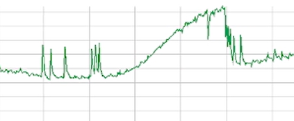

## Final Year Dissertation: Enhancing Immersion: Exploring Environmental Feedback in VR Horror Gaming

This project explores bridging the gap between virtual and real-world experiences by improving
our knowledge of HCI and human factors with VR. This was a large user study to examine what works with fear in a VR setting

## Contents

- [`report.pdf`](./REPORT.pdf) — Full dissertation document
- [`video.mp4`](./Video.mp4) — Presentation or demo video

## Summary of User Study and Findings
## Study Methodology

This study explored user responses to emotionally intense Virtual Reality (VR) environments, using a mixed-method approach that combined observation, biometric tracking, and user feedback. The goal was to investigate how fear and immersion interact in VR-based human-computer interaction.

---

### Playtesting Sessions

- Conducted controlled observation at the Mixed Reality Lab.
- Participants played a VR game while their gameplay was monitored using OBS.
- Real-time notes were taken on both **physical reactions** (e.g., posture, movement) and **virtual interactions** (e.g., in-game decisions, reactions to stimuli).

---

### Physiological Measurements

- **Biometric data** was gathered using the **Shimmer Base 6U** device.
- Key metrics:
  - **Galvanic Skin Response (GSR)** – to measure arousal.
  - **Photoplethysmography (PPG)** – to assess heart rate and tension.
- These data points helped correlate emotional spikes with specific game moments.

---

### Interviews & Questionnaires

- After the VR session, participants were interviewed and asked to complete a survey.
- Data collected included:
  - Self-rated **fear levels** (1–10 scale).
  - Descriptions of the **most frightening** and **tense moments**.
  - Feedback on **sound design**, **visuals**, and **immersion**.
  - Reflections on **physical responses** like breathing, posture, and muscle tension.
- Both **semi-structured interviews** and **structured surveys** were used to combine qualitative and quantitative data.

---

### Data Analysis

- **Observational notes** and gameplay recordings were reviewed to match reactions with in-game stimuli.
- **Physiological data** was analyzed for spikes in arousal during specific moments (e.g., jump scares, dark rooms).
- **Interview and survey responses** were coded for recurring themes related to:
  - Fear responses
  - Immersion
  - Engagement
 
## Results and Discussions

This section presents findings from physiological data (GSR and PPG) and qualitative feedback gathered during and after the VR horror gameplay experience. Real-time biometric responses were recorded during gameplay, while interviews explored users’ emotional and cognitive reactions.

---

### Claustrophobia

Participants identified narrow corridors, dark environments, and disorienting layouts as major sources of fear. The loss of control and visibility increased feelings of vulnerability and panic.

The unreliable flashlight—flickering or cutting out—was a recurring trigger. When it failed, participants often froze, hesitated, or avoided progressing, increasing stress and disrupting engagement. A few users missed visual design cues due to focusing on the floor or the flashlight’s limitations.

> "The flashlight cutting out was annoying but I think it helped make the game more scary."

> "It felt really claustrophobic. Like, even though I knew it was a game, I didn’t feel safe turning corners."

Participants exhibited physical tension, including crouching, freezing, and holding their breath in response to fear.

  <table>
    <tr>
      <th colspan="2" align="center">
        <b>
          PPG spikes indicating a sharp increase in heart rate when the flashlight turned off, suggesting heightened stress and anxiety as the player’s visibility was reduced, increasing uncertainty and fear. Second image depicts a later stage of the game, where the participant is more used to it.
        </b>
      </th>
    </tr>
    <tr>
      <td>
        
      </td>
      <td>
        
      </td>
    </tr>
  </table>

---

### Sound as a Fear Amplifier

Sound emerged as the most consistent factor for inducing fear and immersion. Participants described the layered soundscape as oppressive and unpredictable, with directional audio such as whispers, pig snorts, and voice lines ("it's behind you") keeping them in a heightened state of alert.

> "The sound design constantly made me look over my shoulder. I was on edge the whole time."

The third floor was consistently described as the most stressful zone, correlating with increased PPG values and descriptions of the space as claustrophobic and nerve-wracking.

  <table>
    <tr>
      <th colspan="2" align="center">
        <b>
Figure 13: PPG activity spikes during the third-floor sequence. Elevated heart rate correlates with interview data describing the space as “claustrophobic” and “nerve-wracking,”
with no immediate scare but constant tension from ambient sound.
        </b>
      </th>
    </tr>
    <tr>
      <td>
        
      </td>
      <td>
        
      </td>
    </tr>
  </table>

Randomized sound cues (e.g., distant crashes, growls) triggered strong GSR and PPG reactions, even without visual stimuli. These responses were most prominent early in the experience but diminished as players adapted to the environment.

  <table>
    <tr>
      <th colspan="2" align="center">
        <b>
Left: PPG spike triggered by an unexpected sound cue. Right: GSR spike
showing increased emotional arousal during the same auditory event. These responses
reinforce the role of unpredictable audio in sustaining tension.
        </b>
      </th>
    </tr>
    <tr>
      <td>
        
      </td>
      <td>
        
      </td>
    </tr>
  </table>

Key audio-based events like the first jumpscare and the front door slam also produced strong physiological reactions.

  <table>
    <tr>
      <th colspan="2" align="center">
        <b>
Left: PPG spike marking the primary response to the initial jumpscare. Right:
A smaller anticipatory spike as the participant briefly glimpsed the monster beforehand,
indicating rising fear prior to the main event.
        </b>
      </th>
    </tr>
    <tr>
      <td>
        
      </td>
      <td>
        
      </td>
    </tr>
  </table>

  <table>
    <tr>
      <th colspan="2" align="center">
        <b>
Left: PPG spike following the front door slam. Right: Concurrent PPG
and GSR spikes signal a strong combined physiological response—surprise, stress, and
emotional arousal—immediately after the auditory scare.
        </b>
      </th>
    </tr>
    <tr>
      <td>
        
      </td>
      <td>
        
      </td>
    </tr>
  </table>

---

### Findings from Physiological Measurements

PPG data consistently showed spikes during intense events, including:

- Jump scares (e.g., fridge, mirror)
- High-tension exploration (e.g., staircase, top floor)

These spikes suggest strong sympathetic nervous system activation, aligning with reported fear.

GSR showed less consistency. Two participants displayed strong GSR reactions—one unable to complete the experience, and one who used avoidance strategies (e.g., looking down). This suggests GSR is more affected by individual coping styles and engagement levels.

The most significant arousal occurred not from direct scares, but from prolonged **uncertainty**, including:

- Flashlight outages
- Audio buildup
- Dim staircases

---

### Body Movements and Physical Reactions

Participants exhibited involuntary reactions including:

- Freezing
- Crouching
- Tensing posture

These often occurred near corners or in response to sounds in nearby rooms. The unreliable flashlight contributed to hesitations and cautious exploration.

The design encouraged a tension between fear and curiosity, with players compelled to approach perceived threats despite discomfort. Physical behavior consistently aligned with heightened emotional states.

---

### Shared Quantitative and Qualitative Findings

Physiological spikes closely matched participants’ own reports of the most terrifying moments, including:

- Fridge scare
- Bathroom mirror jumpscare
- Staircase ascent

Notably, some participants who verbally downplayed fear still exhibited significant biometric responses.

> Example: Participant 2 rated fear 4/10 but showed continuous PPG spikes.

In one case, a participant called the bathtub scare “predictable” but still showed both GSR and PPG spikes—demonstrating dissonance between self-reported and physiological fear.

---

### Summary

This study shows that uncertainty, reduced control, and unpredictable sound cues are highly effective at inducing fear in VR. The strongest physiological reactions occurred during moments of reduced visibility and ambiguous threat, rather than during explicit scares.

---

### Outcome

By triangulating **observational**, **biometric**, and **self-reported** data, this methodology provided a holistic view of user experiences in fear-inducing VR environments. The findings will inform the future design of immersive, emotionally responsive VR systems.

